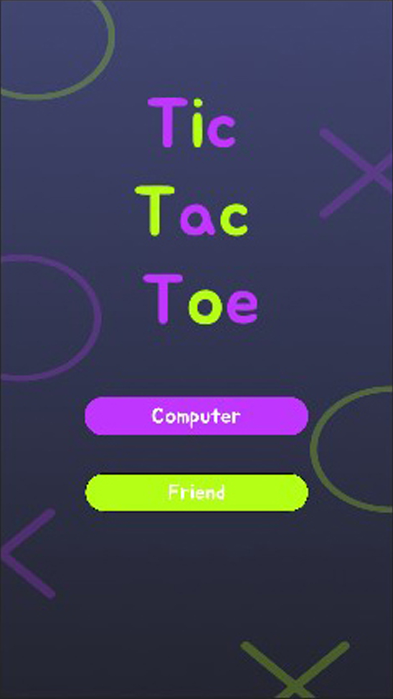

# Tic Tac Toe

This is *Tic Tac Toe* android app, developed in my first year of learning android development. Stop drawing grids over a paper, just install the app and enjoy playing with your friend, anytime, anywhere with pleasing user interface designed to enhance your gaming experience.

## Preview
This app is build with Java in Android Studio.You will find some basic features after the app launches. You are free to choose between two different play modes(Computer mode is launching soon). In Multiplayer Mode, you can enter players' names. Explore more features by yourself!

<!--  -->
<!-- HTML -->

## How to Run

You will need Android Studio 2022.2.1 Patch 2 or above.

- Download the ZIP from the gitHub page and unzip it.
- Open Android Studio.
- Click on the OPEN button and select the unziped folder.
- Click on Trust project if asked to.
- Wait for gradle to download necessary packages.
- Select your Emulator and click on Run app button.
- Enjoy!

## Installation

- Download the latest apk version from the Releases(gitHub  Repository)
- Allow your android device to install from the unknown sources if not allowed.
- Find the app in the app drawer of your android device.
- Enjoy!

## Future Plans

- Versus Computer Mode.
- Visual improvements.
- Implimanting AI to add three difficulty mode.
- Your ongoing games will automatically saved, so you can resume playing right where you left off.

## Credits

This app is developed under the guidance of [Shivansh Gupta](http://gshivg.me/github), head of App Development at [Devoic](https://www.linkedin.com/company/thedevoic/).

<-- ## Contact us

If you have any questions, suggestions, or feedback, please feel free to contact us:

- Email: [tuspatidar7024@gmail.com](mailto:tuspatidar7024@gmal.com)
- LinkedIn: [https://www.linkedin.com/in/tushar-partiar-b30459255/](https://www.linkedin.com/in/tushar-patidar-b30459255/)
- GitHub: [https://github.com/Tushar7024](https://github.com/Tushar7024)

Thank you for choosing the Tic Tac Toe Android App. Let the games begin! -->
